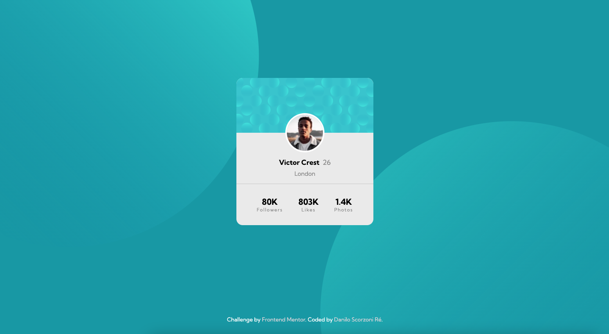
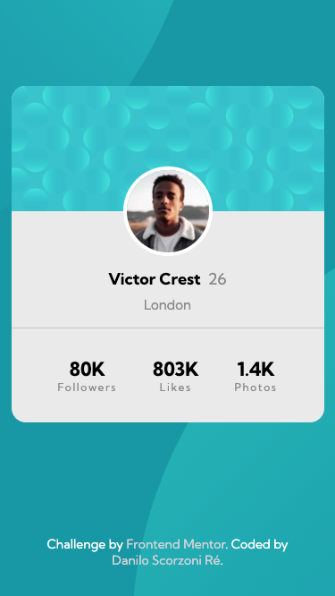

# Frontend Mentor - Profile card component solution

This is a solution to the [Profile card component challenge on Frontend Mentor](https://www.frontendmentor.io/challenges/profile-card-component-cfArpWshJ). Frontend Mentor challenges help you improve your coding skills by building realistic projects.

## Table of contents

- [Overview](#overview)
  - [The challenge](#the-challenge)
  - [Screenshot](#screenshot)
  - [Links](#links)
- [My process](#my-process)
  - [Built with](#built-with)
  - [What I learned](#what-i-learned)
  - [Useful resources](#useful-resources)
- [Author](#author)

## Overview

### The challenge

- Build out the project to the designs provided, including all the details of the card as well as using the SVGs to build a nice background.

### Screenshot

#### Desktop Design:

#### Mobile Design:

### Links

- Solution URL: [Github Code](https://github.com/dscorzoni/project-profile-component)
- Live Site URL: [Github Page](https://dscorzoni.github.io/project-profile-component/)

## My process

### Built with

- Semantic HTML5 markup
- CSS custom properties
- Flexbox

### What I learned

This was my first time playing around with borders and overlaying images, so it was important to learn about position absolute/relative. Also, I had a bit of trouble to figure out responsiveness of background SVGs, so using position: fixed looked to be a reasonable solution.

### Useful resources

- [Images Overlay](https://blog.logrocket.com/guide-image-overlays-css/) - This was a useful guide to understand about position: absolute/relative on using to position the profile picture over the background header.

- [Letter-spacing](https://cssreference.io/property/letter-spacing/) - A quick guide to change the default on letter spacing for displaying the text below the stats.

## Author

- Website - [Danilo Scorzoni Ré](https://github.com/dscorzoni)
- Frontend Mentor - [@dscorzoni](https://www.frontendmentor.io/profile/dscorzoni)
- LinkedIn - [@dscorzoni](https://www.linkedin.com/in/dscorzoni/)
